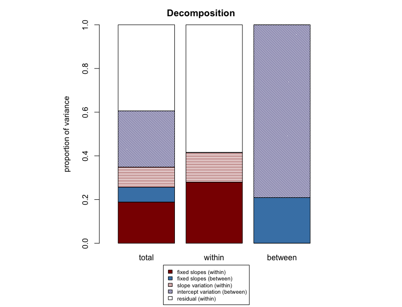

<!-- README.md is generated from README.Rmd. Please edit that file -->

# r2mlm

<!-- badges: start -->

[](https://cran.r-project.org/package=r2mlm)
<!-- badges: end -->

The r2mlm package contains functions that compute a framework of total
and level-specific R-squared measures for multilevel models, with
accompanying plots; these plots allow interpreting and visualizing all
of the measures together as an integrated set. The framework of
R-squared measures subsumes and analytically relates 10
previously-developed measures as special cases of 5 measures from this
framework, as well as provides several new measures. The framework is
presented in Rights & Sterba (2019) for evaluating a single fitted
multilevel model. The implementation of this framework of measures for
comparing multilevel models using R-squared differences is described in
Rights & Sterba (2020). The functions in this package allow users to
input either model objects obtained from
[lme4](https://cran.r-project.org/web/packages/lme4/index.html) or
[nlme](https://cran.r-project.org/web/packages/nlme/index.html), or to
manually input model parameter estimates.

## Installation

You can install the released version of r2mlm from
[CRAN](https://CRAN.R-project.org) with:

``` r
install.packages("r2mlm")
```

And the development version from [GitHub](https://github.com/) with:

``` r
# install.packages("devtools")
devtools::install_github("mkshaw/r2mlm")
```

## Example

Suppose you have a dataset consisting of teachers nested within schools.
A researcher could specify a multilevel model with teacher job
satisfaction as the outcome, which is predicted by the level-1 predictor
teacher salary (here school-mean-centered) and the level-2 predictor
student-teacher ratio. Suppose the multilevel model included a random
intercept as well as a random slope of teacher salary, and included
normally-distributed, homoscedastic level-1 residuals. The researcher
could then obtain the following output (see r2mlm function for further
details).

``` r
library(r2mlm)
#> Loading required package: lme4
#> Loading required package: Matrix
#> Loading required package: nlme
#> 
#> Attaching package: 'nlme'
#> The following object is masked from 'package:lme4':
#> 
#>     lmList

# Generate the model, in this case with lme4:
model <- lmer(satisfaction ~ 1 + salary_c + s_t_ratio + (1 + salary_c | schoolID), data = teachsat, REML = TRUE)

# Generate R-squared measures for that model:
r2mlm(model)
```



    #> $Decompositions
    #>                 total              within             between          
    #> fixed, within   0.0817367298644048 0.142930358177837  NA               
    #> fixed, between  0.0650803204186671 NA                 0.152008530367315
    #> slope variation 0.0376662281262814 0.0658657067175134 NA               
    #> mean variation  0.363055654986177  NA                 0.847991469632685
    #> sigma2          0.452461066604469  0.79120393510465   NA               
    #> 
    #> $R2s
    #>     total              within             between          
    #> f1  0.0817367298644048 0.142930358177837  NA               
    #> f2  0.0650803204186671 NA                 0.152008530367315
    #> v   0.0376662281262814 0.0658657067175134 NA               
    #> m   0.363055654986177  NA                 0.847991469632685
    #> f   0.146817050283072  NA                 NA               
    #> fv  0.184483278409353  0.20879606489535   NA               
    #> fvm 0.547538933395531  NA                 NA

## Package Functions

There are two main functions currently available in r2mlm:

1.  `r2mlm()`, for computing variance explained for a single multilevel
    model.
2.  `r2mlm_comp()`, for comparing variance explained between two
    different multilevel models.

In some cases, you might run a multilevel model that will not converge
in `nlme` or `lme4`, but will converge in another software package
(e.g., HLM, Mplus). If you run your model and obtain the associated
output, you can manually generate R-squared measures using
`r2mlm_manual()` or `r2mlm_comp_manual()`. For manual entry details, see
the help pages:

``` r
?r2mm_manual()
?r2mlm_comp_manual()
```

## Framework Assumptions

This framework of variance explained assumes the following:

1.  Two-level multilevel linear models (3 or more levels not supported
    at this time);
2.  Normal outcome variable;
3.  Homoscedastic residual variances at both level 1 and level 2.

## References

Rights, J. D., & Sterba, S. K. (2019). Quantifying explained variance in
multilevel models: An integrative framework for defining R-squared
measures. *Psychological Methods*, *24*(3), 309–338.
<https://doi.org/10.1037/met0000184>

Rights, J. D., & Sterba, S. K. (2020). New recommendations on the use of
R-squared differences in multilevel model comparisons. *Multivariate
Behavioral Research*. <https://doi.org/10.1080/00273171.2019.1660605>
